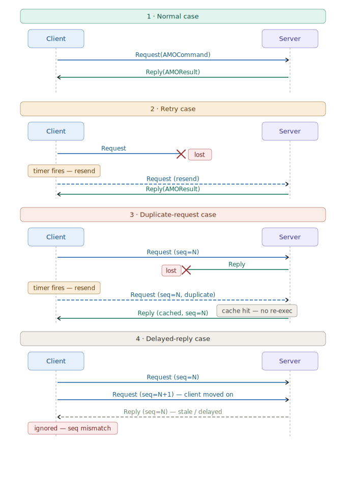

# Lab 1 Design Document

## Preface

### Goals

- Implement an unreplicated server capable of processing commands from multiple clients.
- Provide a client/server protocol for executing commands against a single server-hosted application.
- Guarantee **exactly-once delivery** at the client interface: each logical command should affect the application state at most once and return one corresponding result.
- Tolerate unreliable asynchronous communication, including **message drops, delays, duplication, and reordering**.
- Keep the design application-agnostic by separating the protocol from the specific underlying application.

### Desired fault model

- The network may **drop, delay, duplicate, and reorder** messages.
- Clients and the server follow the protocol.
- The protocol should remain **safe** under unreliable communication.
- The protocol should remain **live** as long as the client and server remain up and messages can eventually get through.

### Challenges

- If a request is dropped, the client must retransmit.
- If a reply is dropped, the client must retransmit even though the server may already have executed the command.
- If a request is duplicated, the server must not execute the underlying application command twice.
- If a reply is delayed or duplicated, the client must not mistake it for the reply to a new command.
- Search tests explicitly model delayed and duplicated delivery, so stale messages must be handled carefully.

### Assumptions

- There is **one server**.
- Each client has **at most one outstanding request at a time**.
- The application is deterministic.
- Sequence numbers are maintained **per client** and increase only when a client issues a new logical command, not when it retries.
- The protocol does not attempt to tolerate **permanent server crashes**, since there is no replication in lab 1.

---

## Protocol

### Kinds of node

- **Client**
  - Issues commands to the service one at a time.
  - Retransmits the current request until a matching reply is received.
  - Returns the result to the external client interface.
- **Server**
  - Receives client requests.
  - Executes commands against the underlying deterministic application.
  - Ensures **at-most-once execution** of each logical client command by detecting duplicate requests and reusing cached results.

### State at each kind of node

#### State at the client

##### `serverAddress`

- **Type:** address
- **Meaning:** the fixed destination to which all client requests are sent
- **Initial value:** provided when the client is constructed
- **Constraint:** never changes

##### `request`

- **Type:** optional `Request`
- **Meaning:** the current outstanding request, if any
- **Contents of `Request`:**
  - one `AMOCommand`, which contains:
    - the underlying application command
    - the client’s address
    - the client’s sequence number for that command
- **Initial value:** absent
- **Evolution:**
  - set when the client sends a new command
  - unchanged across retransmissions of that same logical command
  - replaced only when a later command is issued
- **Interpretation:**
  - if present, the client is waiting for a reply to this logical command

##### `reply`

- **Type:** optional `Reply`
- **Meaning:** the reply corresponding to the client’s current outstanding request, if already received
- **Contents of `Reply`:**
  - one `AMOResult`, which contains:
    - the underlying application result
    - the client address
    - the sequence number of the logical command that produced the result
- **Initial value:** absent
- **Evolution:**
  - cleared whenever a new command is sent
  - set when a matching reply is received
- **Interpretation:**
  - absent means the client is still waiting
  - present means the current command has completed and its result is available

##### `sequenceNum`

- **Type:** integer
- **Meaning:** the sequence number that will be assigned to the next newly issued command
- **Initial value:** `0`
- **Evolution:**
  - incremented exactly once for each new logical command issued through `sendCommand`
  - not changed when a request is retransmitted
- **Constraint:** monotonically increasing

#### Intuition for the client state

  The client keeps track of exactly one outstanding logical request at a time.
  The `request` field identifies the current command being retried, while the `reply` field stores the first matching result that arrives.
  The `sequenceNum` field distinguishes newer commands from older ones and ensures that delayed or duplicated replies can be recognized as stale.

---

#### State at the server

##### `app`

- **Type:** `AMOApplication<Application>`
- **Meaning:** an at-most-once wrapper around the underlying deterministic application
- **Initial value:** created when the server is constructed by wrapping the provided application
- **Constraint:** never changes after initialization

#### Intuition for the server state

  The server itself keeps very little direct protocol state.
  Instead, the at-most-once logic is delegated to the wrapped `AMOApplication`, which is responsible for detecting duplicate logical requests and returning cached results instead of re-executing the underlying command.

---

#### State inside `AMOApplication`

##### `application`

- **Type:** deterministic application
- **Meaning:** the underlying application state machine that actually executes commands
- **Initial value:** provided in the `AMOApplication` constructor
- **Constraint:** commands are executed through this object only when they are determined to be new

##### `lastSequenceNums`

- **Type:** map from client address to integer
- **Meaning:** for each client, the largest sequence number that has already been executed
- **Initial value:** empty map
- **Evolution:** updated when a new command from that client is executed
- **Constraint:** for each client, values increase monotonically

##### `executedResults`

- **Type:** map from client address to `AMOResult`
- **Meaning:** for each client, the cached result of the most recently executed command
- **Initial value:** empty map
- **Evolution:**
  - updated whenever a new command from that client is executed
  - reused when a duplicate request for that same or an older sequence number arrives

#### Intuition for the at-most-once state

  For each client, the system remembers:

- the latest executed sequence number
- the result produced by that latest execution

This is the state that prevents duplicate execution.  
If the server receives a retransmission of a command whose sequence number has already been executed, it does not run the underlying application again. Instead, it returns the cached result from `executedResults`.

## Messages

### Overview

  

---

### Request

- Source: client

- Destination: server

- Contents: `AMOCommand`

- When is it sent?
  - When the client receives a new command from the external client interface
  - When the retry timer fires for the current outstanding request and no matching reply has been received yet

- Can it be sent spontaneously?
  - Yes
    - when the client is given a new external command
    - when the retry timer fires

- What happens at the destination when it is received? Let the request identity be `(clientAddress, sequenceNum)`.

The server checks `lastExecuted` for that client.

- Cases:

  1. **New request**
    - If this sequence number is newer than the latest executed sequence number for that client:
      - execute the underlying application command
      - wrap the result in an `AMOResult`
      - update `lastExecuted`
      - send a `Reply`

  2. **Duplicate retry of latest request**
    - If this sequence number equals the latest executed sequence number for that client:
      - do **not** execute the application again
      - resend the cached `Reply`

  3. **Older stale request**
    - If this sequence number is older than the latest executed sequence number for that client:
      - ignore it as stale

The server sets no timer.

---

### Reply

- Source: server

- Destination: client

- Contents: `AMOResult`

- When is it sent?
  - In response to a `Request`
  - Sent both for: a newly executed command, a duplicate retry of the latest command

- Can it be sent spontaneously? No, only in response to a request.

- What happens at the destination when it is received? The client compares the reply’s `(clientAddress, sequenceNum)` against its current `pendingCommand`.

- Cases:

  1. **Matching reply**
    - If the reply matches the current outstanding request: store it in `pendingResult`, wake any thread waiting in `getResult`

  2. **Stale or irrelevant reply**
    - If the reply does not match the current outstanding request: ignore it

This prevents a delayed or duplicated old reply from being mistaken for the result of a newer command.

---

## Timers

This protocol uses the **resend/discard pattern**:
- the timer stores enough information to determine whether it is still current
- if it is stale when it fires, it is ignored and not reset
- if it is still current, the request is resent and the timer is reset

---

### ClientTimer

**Role.** The client assumes the network may drop messages. It uses `ClientTimer` to implement **at-least-once delivery** of the current RPC: if no matching reply shows up within a fixed delay, the client **resends the same** `Request`. Part 3 adds **at-most-once execution** on the server; the timer behavior stays the same—only the payload (`AMOCommand` inside the `Request`) carries the deduplication metadata.

**Who sets it.** Only the **client** node (`SimpleClient`). The server does not use timers in this lab.

**Payload (what the timer “remembers”).** In code, the timer holds a **`Request`**, not the bare `AMOCommand`. That `Request` wraps the outstanding **`AMOCommand`** (inner command + client address + sequence number). Storing the whole `Request` ties the timer to the **exact message** the client would resend, and the handler compares **sequence numbers** on the wrapped command to detect staleness.

**Delay.** The period is a constant (e.g. `CLIENT_RETRY_MILLIS`, on the order of 100 ms). It is a trade-off: shorter values retry sooner under loss but create more traffic; longer values increase latency after a drop.

**When it is scheduled**

1. **After each new command from the application** — in `sendCommand`, the client builds a fresh `Request`, clears the previous result, sends to the server, then calls `set(new ClientTimer(request), delay)`. A **new** timer instance is associated with that send.
2. **After each retry** — when the timer fires and the client decides the RPC is still pending, it **resends** the same `Request` and calls `set` again. The implementation reuses the **same** `ClientTimer` object (`set(t, delay)`), which keeps the timer queue from growing unbounded stale entries (see the lab README discussion of timer-queue blow-up).

**Handler logic (`onClientTimer`) — resend/discard**

When the timer fires, the framework delivers it to `onClientTimer`. The client runs (under the same lock used for `sendCommand` / `handleReply` / `getResult`) a **three-way guard**:

1. There is still an outstanding logical RPC (`pendingCommand` / `request != null`).
2. The timer’s embedded `Request` is for the **same** operation as the current outstanding one — concretely, the **sequence numbers** on the inner `AMOCommand` match (so this timer is not left over from a **previous** command after `sendCommand` advanced the client).
3. The client still has **no** accepted reply for that RPC (`pendingResult` / `reply == null`).

**Outcomes**

| Situation | Action |
|-----------|--------|
| All guards pass | **Resend** the current `Request` to the server, then **reset** the same timer with `set(t, delay)` so another retry can occur if needed. |
| Reply already stored | **Do nothing** and **do not** call `set`. A late timer after success must **not** reschedule itself (discard pattern). |
| Newer command superseded this timer | Sequence mismatch → **ignore**; do not reset. |
| No outstanding request | **Ignore**; do not reset. |

**Why this matches “resend/discard” (not tick).** A **tick** timer would fire periodically from `init` and scan state every time. Here, each timer is **tied to one outstanding RPC** and is only extended while that RPC is still incomplete. There is no global “heartbeat” timer on the client.

**Interaction with `getResult`.** Threads blocked in `getResult` wait until a **matching** `Reply` is stored; timer retries do not return a result by themselves—they only increase the chance a reply eventually arrives. Waking happens in the reply handler, not in the timer handler.

**Summary.** `ClientTimer` is the client’s **retry clock** for the **current** `Request`: resend and refresh the timer while waiting; **never** refresh after the matching reply is accepted or after the timer is known to be for an old command.

### Server timers
- None

---

## Correctness / Liveness Analysis

### Overview table

| Message type | Drop | Delay | Duplicate | Reorder |
|---|---|---|---|---|
| Request | Client retries until one arrives | Delayed old request is recognized as duplicate or stale | Duplicate request is not re-executed | Reordered copies are safe because server checks request identity |
| Reply | Client retries request until result is obtained | Delayed reply is ignored if stale | Duplicate reply is harmless because client only accepts matching reply | Reordered replies are safe for the same reason |

---

### Request correctness and liveness

#### Drops
- If a request is dropped, the client does not receive a reply.
- The retry timer eventually fires and resends the same logical request.
- Safety holds because retries use the same `(clientAddress, sequenceNum)`.
- Liveness holds if communication is eventually restored.

#### Delays
- If a request is delayed, a retry may reach the server first.
- When the delayed original later arrives, it is recognized as a duplicate or stale request.
- The command is therefore not executed more than once.

#### Duplicates
- Duplicate requests carry the same logical identity.
- The server detects duplicates using `(clientAddress, sequenceNum)` and resends the cached reply.

#### Reordering
- Reordering behaves like arbitrary delay.
- Since the server only executes requests that are newer than the latest executed one for that client, old reordered copies do not corrupt state.

---

### Reply correctness and liveness

#### Drops
- If a reply is dropped, the client continues retrying its request.
- The server responds to the retry using the cached result.
- Thus the command is still completed without duplicate execution.

#### Delays
- A delayed reply may arrive after the client has already moved on.
- The client checks reply identity against the current `pendingCommand` and ignores old replies.

#### Duplicates
- Duplicate replies are harmless because the client accepts only the one matching its current outstanding request.

#### Reordering
- Reordered replies are also harmless for the same reason: only the current matching reply is accepted.

---

### Node crash analysis

#### Client crash
- If a client crashes, progress for that client stops while it is down.
- Since there is no persistent client-side recovery mechanism in this lab, liveness for that client is not guaranteed across crash/restart.
- Safety of the server-side application state is still preserved.

#### Server crash
- If the single server crashes permanently, the protocol cannot make progress.
- Since at-most-once metadata is stored in server memory, crash/restart without persistence may lose duplicate-detection state.
- Therefore, the protocol does not guarantee exactly-once semantics across permanent server crashes.

---

### Temporary disappearance / reconnection

#### Client disappears and later reconnects
- While disconnected, it may not make progress.
- After reconnection, retries resume.
- Duplicate requests remain safe because the server recognizes them.

#### Server disappears and later reconnects
- While unavailable, the client keeps retrying.
- Once the server is reachable again, the request can complete.
- If the server did not lose its at-most-once state, it will continue to deduplicate retries correctly.

---

### Network partitions
- A partition between client and server behaves like a prolonged communication failure.
- During the partition, progress may stop.
- After the partition heals, retries eventually succeed.
- Safety is preserved because:
  - duplicate requests are not re-executed
  - stale replies are ignored by the client

---

## Conclusion

### Goals achieved
- **Eventual client-visible completion under unreliable links (while the server is reachable)**
  - the client retries until it accepts a matching reply, so lost or delayed messages do not permanently strand a command
- **At-most-once execution of each logical command at the server**
  - duplicates are recognized using `(clientAddress, sequenceNum)` (via `AMOCommand` / `AMOApplication`)
- **Exactly-once *effect* per logical command from the client’s perspective**
  - at-least-once delivery from retries plus at-most-once execution yields one application outcome per `sendCommand` invocation
- **Application-agnostic design**
  - the at-most-once layer wraps a generic `Application`; the KV store (or any other app) stays unaware of RPC details

### Limitations
- **No fault tolerance for a crashed or partitioned-away server**; liveness assumes the server eventually processes requests and the network is not a permanent cut between client and server
- **Single outstanding request per client** is assumed by the protocol/tests; overlapping RPCs would need extra bookkeeping
- **Single non-replicated server** limits availability and throughput; no leader election or replication in this lab
- **Sequence numbers** are assumed not to wrap in the test workloads